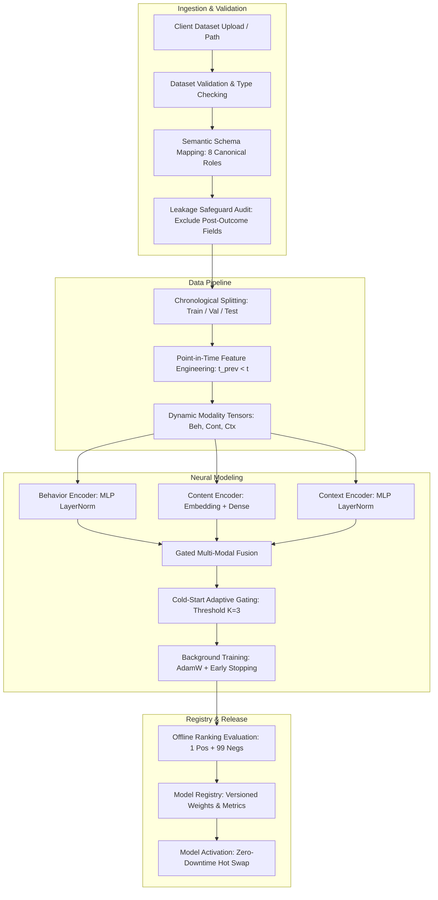
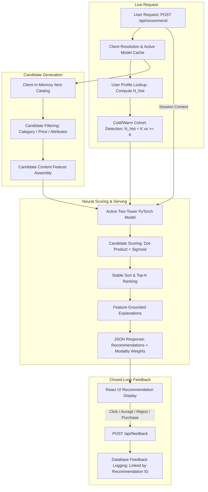

# Real-Time Context-Aware Multi-Client Recommendation Platform: Mitigating Cold-Start via Multi-Modal Behavioral Fusion

A production-grade, multi-client Machine Learning recommendation platform and research system designed to address the user cold-start problem in e-commerce using **Multi-Modal Neural Fusion**, **Dynamic Cold-Start Adaptive Gating**, **FastAPI** real-time serving, and a modern **React** administration and live recommendation dashboard.

---

## 1. Problem Statement
Collaborative Filtering (CF) and behavioral recommendation algorithms depend heavily on dense interaction histories. When deployed in production e-commerce environments, they encounter severe degradation on first-time and sparse-history users—the **user cold-start problem**. In typical e-commerce platforms, cold-start users constitute a massive share of traffic: in our benchmark dataset, **44.34%** of unique customers have fewer than three lifetime interactions. Treating sparse behavioral profiles as reliable preference signals introduces significant noise into recommendation scoring.

---

## 2. Research Motivation & Objectives
The core motivation of this project is to build an architectural mechanism that dynamically adapts input modality representations according to user history depth, rather than relying on brittle manual heuristics:
1. **Multi-Modal Representation:** Jointly encode point-in-time user behavioral history, candidate item content attributes, and real-time session context.
2. **Cold-Start Adaptive Gating:** Dynamically learn modality weights $(\alpha_{\text{beh}}, \alpha_{\text{cont}}, \alpha_{\text{ctx}})$ via neural attention. When user history depth $N_{\text{hist}} < K$ (where $K=3$), the gate automatically suppresses noisy behavioral representations and re-allocates representational capacity to item content and session context.
3. **Zero Future Leakage:** Strictly enforce point-in-time feature aggregation and chronological train/validation/test splitting, guaranteeing zero observation of future events.
4. **Decoupled Multi-Client Platform:** Operationalize the ML system into a multi-tenant FastAPI backend with schema-driven ingestion, dynamic feature dimensions, background training, sub-55ms live inference, and a React SPA.

---

## 3. System Architecture

The platform clearly decouples the **Offline Client Onboarding & Model Lifecycle Path** from the **Online Real-Time Serving Path**:

### A. Client Onboarding & Offline Training Path


### B. Online Real-Time Serving Path


---

## 4. Reference Dataset Specification
Evaluated on the Kaggle *"Indian E-Commerce Customer Behavior & Purchase"* benchmark (`Ecommerce.csv`):
- **Total Interactions:** 25,000 records
- **Original Columns:** 29 columns
- **Memory Footprint:** 5.94 MB
- **Unique Customers:** 8,442
- **Unique Products:** 899 catalog products across 8 categories
- **Overall Target Distribution (`purchased`):**
  - Non-purchased (0): 19,384 (77.54%)
  - Purchased (1): 5,616 (22.46%)
- **Customer Interaction Depth:**
  - Mean: 2.96 ($\sigma = 1.55$), Min: 1, 25%: 2, Median: 3, 75%: 4, Max: 11
  - Customer-level Cold Users ($N_{\text{lifetime}} < 3$): 3,743 customers (**44.34%**)
  - Customer-level Warm Users ($N_{\text{lifetime}} \ge 3$): 4,699 customers (**55.66%**)

### Chronological Splits (Verified Row Counts)
- **Train Set:** 14,494 rows (2024-01-01 to 2024-07-31) | 3,258 positive purchases
- **Validation Set:** 4,212 rows (2024-08-01 to 2024-09-30) | 981 positive purchases
- **Test Set:** 6,294 rows (2024-10-01 to 2024-12-30) | 1,377 positive purchases

---

## 5. Leakage-Safety Protocol & Excluded Fields

### Excluded Post-Outcome Fields
The following fields are strictly excluded from predictive model inputs:
- `added_to_cart`: Downstream conversion action occurring after recommendation
- `revenue`, `revenue_normalized`: Realized financial outcome
- `rating`: Customer satisfaction score recorded post-delivery
- `review_text`, `review_helpful_votes`: Text feedback submitted post-consumption
- `cart_abandoned`: Downstream session outcome
- `payment_method`: Selected at checkout completion

### Current-Session Exclusions
Current-session duration (`time_on_site_sec`) and current-session pages viewed (`pages_viewed`) are excluded as predictors of current-session recommendations; only prior-session historical aggregates are permitted.

### Point-in-Time Behavioral Aggregation
For an interaction occurring at timestamp $t_i$:
$$\text{History}(c, t_i) = \{ (x_j, y_j, t_j) \in \mathcal{D} \mid \text{customer}(x_j) = c \land t_j < t_i \}$$
All historical feature calculations strictly use data prior to $t_i$. Automated tests (`test_pipeline.py`) verify that no future row indices are accessed.

---

## 6. Final Feature Table (Reference Client)

| Modality | Dims | Features Included |
| :--- | :---: | :--- |
| **Behavioral** | **16** | `hist_interaction_count`, `hist_purchase_count`, `hist_purchase_rate`, `hist_revenue`, `hist_cart_add_rate`, `hist_avg_pages_viewed`, `hist_avg_time_on_site`, `recency_score`, `hist_cat_pref_0` ... `hist_cat_pref_7` (8 categories) |
| **Content** | **12** | Product ID embedding (dim 8), product category embedding (dim 8 projected), standardized `unit_price`, `discount_percent`, `discount_amount` |
| **Context** | **21** | Device type (3 one-hot), user type (2 one-hot), marketing channel (6 one-hot), season (4 one-hot), cyclical day ($\sin/\cos$), cyclical month ($\sin/\cos$), cyclical weekday ($\sin/\cos$), location ID |

---

## 7. Model Architecture & Cold-Start Adaptive Gating

```
User Behavioral [16]  --> [Behavior Encoder (MLP 64->32)]  --> h_beh [32]
Item Content    [12]  --> [Content Encoder (MLP 64->32)]   --> h_cont [32]
Session Context [21]  --> [Context Encoder (MLP 64->32)]   --> h_ctx [32]
                                      |
                           [Gated Multi-Modal Fusion]
                                      |
                           alpha_beh, alpha_cont, alpha_ctx
                                      |
                           [ColdStartAdaptiveGate]
                        (Suppresses alpha_beh if N_hist < 3)
                                      |
                              h_fused = sum(alpha_m * h_m)
                                      |
                           [Candidate Scoring Tower]
                                      |
                                 Sigmoid Score
```

### Cold-Start Boundary Rule
$$\text{Status} = \begin{cases} \text{Cold Start}, & N_{\text{hist}} < K \\ \text{Warm Start}, & N_{\text{hist}} \ge K \end{cases}$$
For the primary reference configuration, $K = 3$:
- **Cold Users ($N_{\text{hist}} \in \{0, 1, 2\}$):** Behavioral weight $\alpha_{\text{beh}} \le 0.002$; scoring relies on content and context.
- **Warm Users ($N_{\text{hist}} \ge 3$):** Behavioral encoder activated ($\alpha_{\text{beh}} > 0.05$); full multi-modal fusion.

*Note on Claim Discipline:* Modality weights $\alpha_m$ represent learned gating blending coefficients, not causal feature importances. The model outputs monotonic relevance scores, not calibrated purchase probabilities.

---

## 8. Sampled Offline Ranking Evaluation & Baseline Results

### Sampled Offline Ranking Protocol
Evaluated across all $N=1,377$ positive purchase events in the chronological test set. In this **sampled offline ranking evaluation**, each evaluated positive event is ranked against:
- **1 held-out ground truth positive item**
- **99 sampled unpurchased negative items** (sampled strictly from products the customer **never purchased** across the entire dataset)

Ranking is performed using stable sort descending by candidate score. Metrics are computed over these 100 candidate pools. **Note:** This sampled ranking protocol does NOT rank against the entire 899-item catalog. (Live real-time inference remains distinct, scoring eligible items directly from the live client catalog).

| Model | Cohort | Sample Count | Precision@5 | Recall@5 | NDCG@5 | HitRate@5 | NDCG@10 | MeanRank |
| :--- | :--- | :---: | :---: | :---: | :---: | :---: | :---: | :---: |
| **Popularity** | Overall | 1,377 | 0.0106 | 0.0530 | 0.0320 | 0.0530 | 0.0458 | 50.51 |
| | Cold ($N < 3$) | 777 | 0.0111 | 0.0553 | 0.0347 | 0.0553 | 0.0484 | 50.50 |
| | Warm ($N \ge 3$) | 600 | 0.0100 | 0.0500 | 0.0285 | 0.0500 | 0.0424 | 50.53 |
| **Content-Based** | Overall | 1,377 | 0.0298 | 0.1489 | 0.1374 | 0.1489 | 0.1518 | 31.32 |
| | Cold ($N < 3$) | 777 | 0.0103 | 0.0515 | 0.0312 | 0.0515 | 0.0499 | 36.01 |
| | Warm ($N \ge 3$) | 600 | **0.0550** | **0.2750** | **0.2750** | **0.2750** | **0.2836** | **25.25** |
| **Collaborative Filtering** | Overall | 1,377 | 0.0109 | 0.0545 | 0.0308 | 0.0545 | 0.0464 | 49.89 |
| | Cold ($N < 3$) | 777 | 0.0118 | 0.0592 | 0.0342 | 0.0592 | 0.0505 | 49.86 |
| | Warm ($N \ge 3$) | 600 | 0.0097 | 0.0483 | 0.0264 | 0.0483 | 0.0411 | 49.94 |
| **Multi-Modal (No Adaptation)** | Overall | 1,377 | 0.0129 | 0.0646 | 0.0401 | 0.0646 | 0.0568 | 48.09 |
| | Cold ($N < 3$) | 777 | 0.0136 | 0.0682 | 0.0415 | 0.0682 | 0.0580 | 48.18 |
| | Warm ($N \ge 3$) | 600 | 0.0120 | 0.0600 | 0.0382 | 0.0600 | 0.0553 | 47.98 |
| **Proposed Adaptive Model** | Overall | 1,377 | 0.0121 | 0.0603 | 0.0352 | 0.0603 | 0.0493 | 49.98 |
| | Cold ($N < 3$) | 777 | 0.0124 | 0.0618 | 0.0353 | 0.0618 | 0.0510 | 49.59 |
| | Warm ($N \ge 3$) | 600 | 0.0117 | 0.0583 | 0.0351 | 0.0583 | 0.0470 | 50.49 |

### Empirical Interpretation of Baseline Results
The empirical evidence does **not** establish superior ranking accuracy for the Proposed Adaptive Model:
- **Overall NDCG@5:** Content-Based (0.1374) > Multi-Modal No Adaptation (0.0401) > Proposed Adaptive (0.0352).
- **Cold-Start NDCG@5:** Multi-Modal No Adaptation (0.0415) > Proposed Adaptive (0.0353) > Content-Based (0.0312).
- **Content-Based Result:** Content-Based ranking is particularly strong for warm users in this dataset/evaluation setup (Warm NDCG@5 = 0.2750), whereas its cold-start performance declines substantially (Cold NDCG@5 = 0.0312). Repetitive category affinity is a possible interpretation of this pattern, though it has not been separately established as a causal factor.
- **Proposed Model Conclusion:** The adaptive fusion mechanism successfully enables recommendation for users with sparse or zero behavioral history by suppressing the behavioral modality when history is insufficient. Under the sampled ranking evaluation used in this study, however, adaptive gating did not outperform all comparison methods in ranking accuracy. Its most notable observed characteristic was stable ranking performance across cold- and warm-start cohorts (NDCG@5 = 0.0353 cold vs. 0.0351 warm).

---

## 9. 8-Model Modality Ablation Study

| Ablation Model Configuration | Overall NDCG@5 | Cold-Start NDCG@5 | Warm-Start NDCG@5 | Overall Precision@5 |
| :--- | :---: | :---: | :---: | :---: |
| **Model A: Behavior Only** | 0.0375 | 0.0328 | 0.0435 | 0.0126 |
| **Model B: Content Only** | 0.0330 | 0.0308 | 0.0359 | 0.0118 |
| **Model C: Context Only** | 0.0326 | 0.0326 | 0.0327 | 0.0115 |
| **Model D: Behavior + Content** | 0.0361 | 0.0372 | 0.0348 | 0.0121 |
| **Model E: Behavior + Context** | 0.0407 | 0.0375 | 0.0447 | 0.0139 |
| **Model F: Content + Context** | 0.0323 | 0.0347 | 0.0291 | 0.0112 |
| **Model G: Unweighted Concatenation** | 0.0362 | 0.0334 | 0.0397 | 0.0126 |
| **Model H: Full Proposed Adaptive Fusion** | **0.0352** | **0.0353** | **0.0351** | **0.0121** |

### Empirical Interpretation of Ablation Results
- Model E (Behavior + Context) achieves the highest NDCG@5 in the ablation set: Overall NDCG@5 = 0.0407, Cold NDCG@5 = 0.0375.
- Model H (Full Adaptive Model) achieves Overall NDCG@5 = 0.0352 and Cold NDCG@5 = 0.0353.
- Therefore, the ablation study does not demonstrate that adding every modality plus adaptive gating maximizes ranking accuracy under this protocol. This is documented as a legitimate experimental finding.

---

## 10. Cold-Start Threshold Sensitivity Analysis ($K$)

| Threshold $K$ | Cold Test Count | Warm Test Count | Cold NDCG@5 | Warm NDCG@5 | Overall NDCG@5 |
| :---: | :---: | :---: | :---: | :---: | :---: |
| **$K = 1$** | 129 (9.37%) | 1,248 (90.63%) | 0.0311 | 0.0359 | 0.0354 |
| **$K = 2$** | 411 (29.85%) | 966 (70.15%) | 0.0385 | 0.0345 | 0.0357 |
| **$K = 3$** (Primary) | 777 (56.43%) | 600 (43.57%) | 0.0353 | 0.0351 | 0.0352 |
| **$K = 5$** | 1,231 (89.40%) | 146 (10.60%) | 0.0340 | 0.0393 | 0.0346 |

### Exact Sensitivity Procedure Explanation
In this experiment, predictions and model gating were rerun separately for each threshold $K \in \{1, 2, 3, 5\}$ by calling `proposed_model.cold_start_gate.set_threshold(K)`. This dynamically altered the boolean cold mask inside the PyTorch forward pass, modifying the neural candidate scoring and rankings for affected users across the test set. This explains why overall NDCG@5 varied across $K$ (0.0354 at $K=1$, 0.0357 at $K=2$, 0.0352 at $K=3$, and 0.0346 at $K=5$).

*Cohort Denominator Notice:* Percentages reflect the **1,377 positive test events**. Across all **8,442 unique lifetime customers**, 3,743 (44.34%) have $< 3$ interactions and 4,699 (55.66%) have $\ge 3$ interactions.

---

## 11. Research Question Conclusions

- **RQ1: Can the system generate recommendations for users with sparse or zero behavioral history?**
  - **Answer from evidence:** **Yes, operationally.** The implemented cold-start pathway successfully supports zero-history and sparse-history inference using content and context signals without runtime failures or cold-start crashes.
- **RQ2: Does the adaptive cold-start gate improve ranking accuracy over the comparison methods on this dataset?**
  - **Answer from evidence:** **Not consistently under the reported sampled offline ranking protocol.** While adaptive gating provides balanced ranking across cold and warm cohorts, it did not outperform all comparison baselines (such as Content-Based or unadapted Multi-Modal) in offline ranking metrics.
---

## 12. Multi-Client Dynamic Dimension Support
The platform dynamically configures feature encoders according to client schema mappings:
- **Reference Client (`demo_ecommerce`):** Behavior = 16, Content = 12, Context = 21
- **Validated Alternate Client (`retail_client_b`):** Behavior = 9, Content = 5, Context = 6
Both client architectures execute without modification to core PyTorch or inference service classes.

---

## 13. Local Prototype Latency Performance
Benchmarked on local development environment (Windows, Python 3.13, 899 catalog products, in-memory model cache, 50 repetitions):

| Cohort | Catalog Size | Repetitions | Mean (ms) | Median (ms) | Min (ms) | Max (ms) | Std (ms) |
| :--- | :---: | :---: | :---: | :---: | :---: | :---: | :---: |
| **Cold-Start ($N_{\text{hist}} = 0$)** | 899 | 50 | 48.74 | 45.47 | 31.03 | 128.91 | 16.48 |
| **Warm-Start ($N_{\text{hist}} = 8$)** | 899 | 50 | 50.29 | 48.67 | 42.91 | 69.48 | 5.34 |

---

## 14. Scope of Visual Analytics Component
- **Primary Learned ML Component:** Multi-modal context-aware product recommendation scoring and candidate ranking.
- **Secondary Visual Analytics Component:** Deterministic, rule-based selection and rendering of analytics charts (Recharts in React, Altair in Streamlit) driven by dataset properties.
- **Scope Note:** The e-commerce dataset does *not* contain learned visualization preference labels; chart selection is heuristic.

---

## 15. Installation & Startup Instructions

### Prerequisites
- Python 3.10+ (Tested on Python 3.13)
- Node.js 18+ & npm 9+
- Git

### Installation
```bash
# 1. Clone repository
git clone <repo-url>
cd context_aware_recommender

# 2. Set up Python virtual environment
python -m venv .venv
.venv\Scripts\activate  # Windows: .venv\Scripts\activate | Linux/macOS: source .venv/bin/activate
pip install -r requirements.txt

# 3. Install frontend dependencies
cd frontend
npm install
cd ..
```

### Option A: Production Single-Process Stack (FastAPI + Embedded React SPA)
FastAPI serves the compiled React application directly at the root URL while hosting all REST APIs at `/api/*`:
```bash
# Build React application (if dist/ is not already built)
cd frontend && npm run build && cd ..

# Start FastAPI backend server
.venv\Scripts\python -m uvicorn backend.main:app --host 127.0.0.1 --port 8000
```
- **React Admin & Live Recommender Portal:** [http://127.0.0.1:8000](http://127.0.0.1:8000)
- **Live Recommender Interface:** [http://127.0.0.1:8000/recommend](http://127.0.0.1:8000/recommend)
- **FastAPI Interactive Docs (Swagger UI):** [http://127.0.0.1:8000/docs](http://127.0.0.1:8000/docs)
- **Health Telemetry Endpoint:** [http://127.0.0.1:8000/api/health](http://127.0.0.1:8000/api/health)

### Option B: Separate Frontend Development Server (Vite HMR)
For rapid frontend component iteration with hot module replacement:
```bash
# Terminal 1: Backend API
.venv\Scripts\python -m uvicorn backend.main:app --host 127.0.0.1 --port 8000 --reload

# Terminal 2: React Dev Server (proxies /api to port 8000)
cd frontend
npm run dev
# Portal accessible at http://localhost:3000
```

### Option C: Standalone Streamlit Research Dashboard
The original 10-page Streamlit dashboard remains available for exploratory data analysis:
```bash
.venv\Scripts\streamlit run app/app.py
```

---

## 16. REST API Overview

| Method | Endpoint | Description |
| :--- | :--- | :--- |
| `GET` | `/api/health` | Backend liveness and database telemetry |
| `GET` | `/api/clients` | List all registered tenant clients |
| `POST` | `/api/clients` | Register a new client tenant |
| `POST` | `/api/clients/{id}/dataset` | Upload or register tabular client dataset |
| `GET` | `/api/clients/{id}/schema` | Retrieve inferred / saved schema mapping |
| `POST` | `/api/clients/{id}/schema` | Save confirmed schema mapping across 8 canonical roles |
| `POST` | `/api/clients/{id}/train` | Trigger background model training job |
| `GET` | `/api/clients/{id}/training-status` | Polling endpoint for live training status, epoch, and loss |
| `GET` | `/api/clients/{id}/models` | List all versioned model checkpoints |
| `POST` | `/api/clients/{id}/models/{v}/activate` | Hot-swap active serving model |
| `POST` | `/api/recommend` | Real-time candidate filtering, neural scoring, and ranking |
| `POST` | `/api/feedback` | Record explicit feedback (Click, Accept, Reject, Purchase) |

---

## 17. Verification & Automated Test Manifest

### Backend Test Suite
Executed: `python -m unittest discover -s tests -p "test_*.py"`
- **Result:** **65 passed**, 0 failed
- **Execution Date:** 2026-09-28
- **Modules Covered:**
  - `test_pipeline.py`: Data cleaning, deduplication, chronological split, point-in-time leakage audit, tensor boundary
  - `test_schema_mapper.py`: Schema validation, type inference, role detection, canonical roundtrip
  - `test_backend_api.py`: Multi-client isolation, database integrity, dataset registration
  - `test_model_registry_and_training.py`: Background training state transitions, metric persistence, model activation
  - `test_inference.py`: Live inference, cold/warm boundaries ($N_{\text{hist}} \in \{0, 1, 2, 3, 4\}$), candidate filtering, feedback linking
  - `test_frontend_integration.py`: Static SPA asset serving, HTML client routing, 404 isolation

### Frontend Test Suite
Executed: `npm test` (Vitest 2.1.8 + React Testing Library)
- **Result:** **10 passed**, 0 failed
- **Components Covered:**
  - `RecommendationPage.test.jsx`: Essential controls, 5-card rendering, cold badge suppression, warm badge activation, feedback actions, score formatting, filter controls, error handling
  - `SchemaMappingPage.test.jsx`: Presence and persistence of all 8 canonical roles
  - `TrainingPage.test.jsx`: Live epoch progress and loss rendering

### Production Build
Executed: `npm run build`
- **Result:** Vite production build successful (`dist/` compiled cleanly).

---

## 18. Project Repository Structure
```
context_aware_recommender/
│
├── backend/                            # FastAPI Multi-Client Backend Layer
│   ├── api/                            # REST API Route Modules
│   │   ├── clients.py, datasets.py, schemas.py
│   │   ├── training.py, models.py, recommendations.py, feedback.py
│   ├── database/                       # SQLAlchemy Models & SQLite Engine
│   ├── schemas/                        # Pydantic Request & Response Contracts
│   ├── services/                       # Business Logic & Orchestration
│   │   ├── client_service.py, dataset_service.py, schema_service.py
│   │   ├── training_service.py, model_service.py, inference_service.py, feedback_service.py
│   └── main.py                         # FastAPI Application Entrypoint & SPA Mount
│
├── frontend/                           # React 18 Production Single-Page App
│   ├── src/
│   │   ├── components/                 # Navigation, HealthBadge, Metrics, Reusable UI
│   │   ├── constants/schemaRoles.js   # 8 Canonical Schema Roles (Single Source of Truth)
│   │   ├── context/ClientContext.jsx   # Global Active Client State Provider
│   │   ├── pages/admin/                # Client Management, Dataset, Schema, Training, Models, Analytics, Feedback
│   │   ├── pages/recommender/          # Live Interactive Recommender View
│   │   ├── services/api.js             # Axios API Client
│   │   └── tests/                      # Vitest + React Testing Library Test Suite
│   ├── package.json, vite.config.js, vitest.config.js
│
├── src/                                # Core Reusable Machine Learning Modules
│   ├── models/
│   │   ├── behavior_encoder.py         # Behavioral Feature MLP Encoder
│   │   ├── content_encoder.py          # Item Content MLP Encoder
│   │   ├── context_encoder.py          # Session Context MLP Encoder
│   │   ├── fusion_model.py             # Neural Gated Fusion Network
│   │   ├── cold_start.py               # ColdStartAdaptiveGate Module
│   │   ├── ranker.py                   # Offline Candidate Pools & Ranking Metrics
│   │   └── recommender.py              # Baseline Recommenders & Model Evaluators
│   ├── data_ingestion.py               # Ingestion & Encoding Verification
│   ├── preprocessing.py                # Cleaning, Outlier IQR Capping, Chronological Splitting
│   ├── feature_engineering.py          # Point-in-Time Behavioral Aggregates & Leakage Audits
│   ├── schema_mapper.py                # Schema Role Ingestion & Validation Engine
│   └── visualization.py                # Secondary Rule-Based Visual Analytics Engine
│
├── data/
│   ├── raw/Ecommerce.csv               # Reference Kaggle Dataset (25,000 interactions)
│   ├── processed/                      # Cleaned splits, feature tensors, and candidate pools
│   └── platform.db                     # SQLite Multi-Tenant Metadata Database
│
├── docs/
│   ├── DEMO_SCRIPT.md                  # 5-8 Minute Demonstration Walkthrough
│   └── PROJECT_REPORT_NOTES.md         # Comprehensive Report Notes & Background
│
├── outputs/
│   ├── final_results/                  # Machine-Readable Artifacts & Benchmarks
│   │   ├── baseline_results.csv, ablation_results.csv, cold_start_sensitivity.csv
│   │   ├── final_metrics.json, experiment_config.json, latency_benchmark.json
│   │   └── figures/                    # Publication-Quality Research Charts (A through F)
│   ├── dataset_metadata.json
│   └── feature_summary.json
│
├── tests/                              # Python Unit & Integration Test Suite (65 tests)
├── app/app.py                          # Preserved Streamlit Visual Analytics Dashboard
├── requirements.txt                    # Python Environment Dependencies
└── README.md                           # Complete Project Documentation Entrypoint
```

---

## 19. Limitations
1. **Catalog Retrieval Scale:** Candidate ranking executes exact dense matrix multiplication over the 899-item catalog. While latency is under 55ms for this catalog size, scaling to hundreds of thousands of items would require an Approximate Nearest Neighbor (ANN) index (e.g., FAISS).
2. **Score Calibration:** Sigmoid outputs represent relative recommendation relevance scores, not calibrated purchase probabilities.
3. **Representational vs. Causal Attention:** Attention gating weights represent representational mixing coefficients, not causal feature importance.
4. **Local Single-Node Infrastructure:** Uses SQLite and FastAPI in-memory `BackgroundTasks` rather than distributed task brokers (Celery/Redis) or cloud object storage.
5. **No Production Authentication:** Designed as a local academic and demonstration prototype without JWT/OAuth role-based access control.

---

## 20. Future Work
- Integration of a vector index retrieval stage (HNSW / FAISS) for candidate generation on massive catalogs.
- Implementation of probability calibration methods (isotonic regression, temperature scaling) for expected revenue estimation.
- Multi-armed bandit exploration (e.g., Thompson Sampling) to actively acquire interactions for new items and users.
- Production migration to Redis/Celery worker queues with cloud object storage backing.
